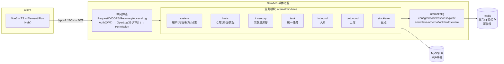
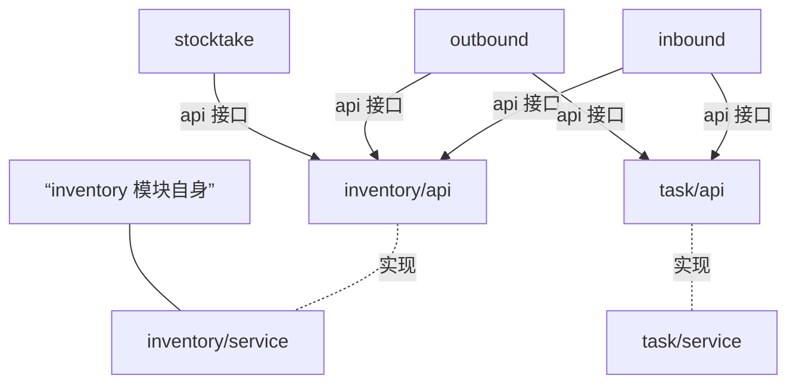
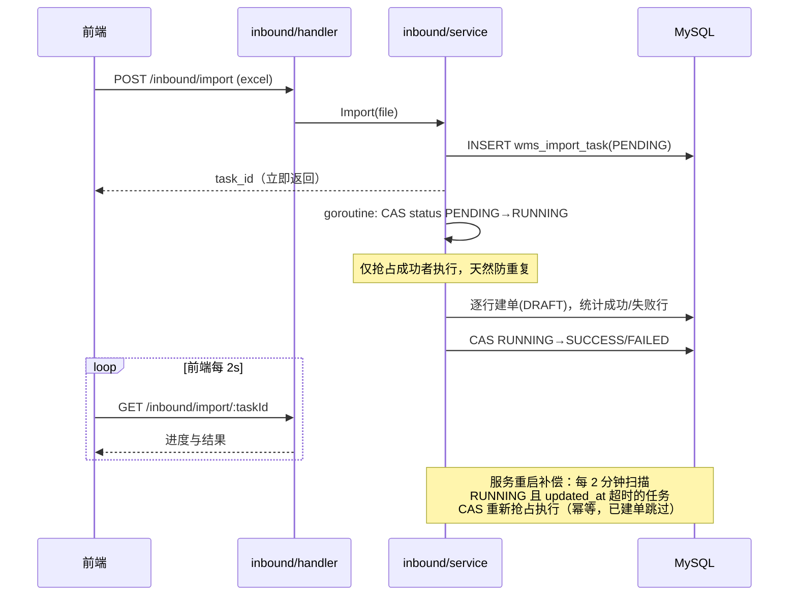
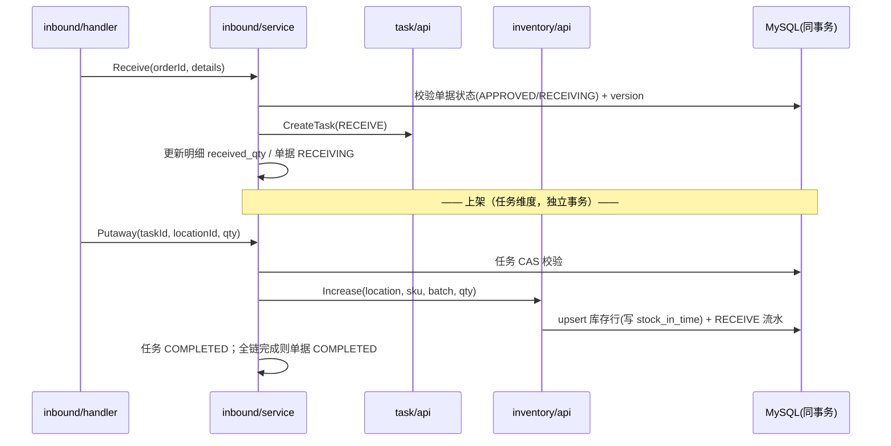
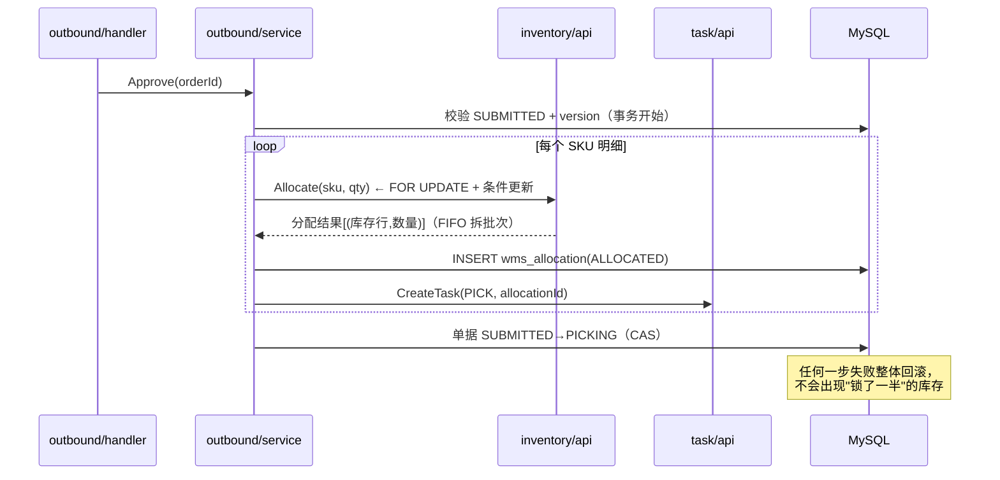

# GoWMS 系统架构设计

> 版本：v1.0 ｜ 配套代码：本仓库 `internal/` 目录

## 1. 总体架构

**模块化单体（Modular Monolith）**：一个进程、一个数据库，内部按业务域划分 7 个模块；模块间**只通过 API 接口层通信**（依赖倒置），与微服务拆分后的服务间调用同构，未来可按模块直接拆出。



### 1.1 模块依赖关系（编译期强制）



规则：

1. **依赖方向单向**：`inbound/outbound/stocktake → inventory/task 的 api 包 → 各自的 service 包`；基础模块（inventory/task）**不知道**业务模块存在；
2. `api` 包只定义接口 + DTO（如 `IncreaseReq`、`CreateTask`），由 `internal/app` 在启动时把实现注入（手动构造注入，无框架魔法）；
3. 禁止跨层访问：`inbound/repository` 不可以直接 import `outbound/model`。

这样，"拆微服务"时把 `api` 接口换成 RPC 客户端即可，业务代码零改动。

### 1.2 分层设计

| 层 | 职责 | 约束 |
| --- | --- | --- |
| handler | 参数绑定/校验、调 Service、组装响应 | **无业务逻辑、不开事务** |
| service | 业务规则、状态机、**事务边界**（`tx.WithTx`） | 跨模块协作只调其他模块的 api 接口 |
| repository | 数据访问，只操作本模块表 | 不感知业务状态机 |
| api | 接口 + DTO | 无实现，供其他模块 import |

事务只允许在 Service 层开启（`internal/pkg/tx`），传递 `*gorm.DB`（nil 则用全局连接）逐层下沉，保证"一个用例一个事务"。

## 2. 技术选型与理由

| 选型 | 理由 |
| --- | --- |
| Gin | 生态成熟、中间件模型清晰，学习成本最低 |
| GORM | AutoMigrate 让项目零 SQL 文件即可启动；同时保留手写 SQL 能力（条件更新/FIFO 锁） |
| MySQL 8.0.16+ | 唯一使用 `CHECK` 约束强制的版本，防负库存最后一道兜底 |
| Redis | **增强件而非依赖件**：单号生成（Lua 原子自增）与条码缓存，不可用自动降级，不阻塞业务 |
| Vue3 + TS + Vite + Pinia + Element Plus | 主流企业前端栈；组合式 API + 类型完备的 API 层 |

**刻意不引入**：消息队列（单库事务已满足一致性）、微服务框架（拆分点已预留）、ORM 拦截器魔法（显式代码优于隐式行为）。

## 3. 核心设计详解

### 3.1 三数量库存模型

```
stock_quantity（存量） = available_quantity（可用） + allocated_quantity（分配）
```

- **可用**：还能被新订单分配的数量；
- **分配**：已被出库单锁定、等待拣货发货的数量（"冻结"语义）；
- 每次变动写 `wms_inventory_trans` 流水，记录变更前后**存量/可用两组数**，任意时刻可对账。

| 动作 | available | allocated | stock | 流水类型 |
| --- | --- | --- | --- | --- |
| 上架入库 | +n | — | +n | RECEIVE |
| 审核（分配/锁库） | −n | +n | — | ALLOCATE |
| 发货（扣减） | — | −n | −n | SHIP |
| 取消（释放） | +n | −n | — | RELEASE |
| 盘点调整 | ±n | — | ±n | ADJUST |

不变量：`stock = available + allocated` 恒成立，且有集成测试 `TestShipReleaseInvariant` 保证。

### 3.2 双重防超卖（面试高频）

`inventory/service.Allocate` 在**同一个事务**内做两层防护：

```text
① SELECT ... FOR UPDATE          → 悲观行锁，串行化同一库存行的并发操作
② UPDATE wms_inventory
   SET available = available - ?,
       allocated = allocated + ?,
       version = version + 1
   WHERE id = ?
     AND available >= ?          → 条件更新，即使锁失效也不会扣成负数
     AND version = ?             → 乐观锁双保险
```

加上数据库层 `CHECK (available_quantity >= 0)` 约束兜底。**验证**：`TestConcurrentAllocateAntiOversell` 以 100 可用量对抗 200 并发分配，断言恰好成功 100 次、恒等式不破。

### 3.3 FIFO 分配

审核出库时，按 `stock_in_time`（首次上架时间）升序锁定同 SKU 的库存行，逐批扣减可用量，拆分成多条 `wms_allocation`（含库位、批次、数量）。拣货时作业人员按分配行直达库位，不需要自己找货。

### 3.4 单据状态机

- 每个模块 `model` 包定义 `StatusTransitions map[Status][]Status`（合法后继状态）；
- Service 层流转前显式校验，拒绝非法跳转；
- 状态更新走 `WHERE status = 期望前态 AND version = n`（CAS + 乐观锁），并发双击只会成功一次。

### 3.5 单号生成器（Redis Lua + 三级降级）

`internal/pkg/orderno`，格式 `{前缀}{yyyyMMdd}{5位日内序号}`，如 `RK20260830-00042`：

1. **Redis Lua**：`INCR` 当日序号并设置当日过期，原子且无锁竞争；
2. **降级本地**：Redis 不可用时进程内原子自增（单实例够用）；
3. **唯一索引兜底**：插入撞唯一索引时重取序号重试，跨实例降级模式也不产生重复单号。

### 3.6 Excel 异步导入（可靠性设计样本）



三个关键点：**状态机**（PENDING/RUNNING/SUCCESS/FAILED）、**CAS 抢占**（goroutine 与补偿扫描互斥）、**悬挂补偿**（重启自愈）。

### 3.7 认证 / 权限 / 审计

- **JWT**：登录签发（HS256，可配置过期），`middleware.Auth` 统一解析注入 `user_id/username`；
- **权限**：`middleware.Permission(checker, "wms:inbound:approve")` 路由级校验，权限串来自用户角色聚合（内置 admin 为 `*`）；
- **审计**：`middleware.OperLog` 对所有写方法（非 GET）**异步**记录请求参数、IP、耗时、结果，不阻塞主流程。

### 3.8 全局工程约定

| 约定 | 实现 |
| --- | --- |
| 主键 | 雪花 ID（`internal/pkg/snowflake`），趋势递增、不暴露量级 |
| 乐观锁 | 单据/任务/分配/库存行均带 `version` |
| 软删除 | GORM `deleted_at`，业务查询自动过滤 |
| 统一响应 | `{code, msg, data}`，业务错误码集中于 `internal/pkg/errcode` |
| 配置 | `configs/config.yaml`，结构体映射 `internal/pkg/config` |

## 4. 关键流程时序

### 4.1 入库：审核 → 收货 → 上架



### 4.2 出库：审核即分配（核心）



## 5. 前端架构（web/）

```
web/src/
├── api/          # 类型完备的请求层：axios 实例 + 按模块 api + DTO 类型
├── stores/       # Pinia：auth(token/用户) / theme(双主题持久化)
├── layouts/      # Layout：侧边栏/顶栏/面包屑/主题切换
├── views/        # 16 个业务页面，按模块分目录
├── components/   # 业务弹窗组件（拣货/上架）
├── constants.ts  # 状态→文案/标签色的唯一映射点
└── router/       # 路由 + meta.title + 登录守卫
```

工程化亮点：

- **双主题**：CSS 变量令牌（浅色靛紫 / 深色翡翠绿）直接覆盖 Element Plus 变量，16 个页面零改动换肤，`html.dark` + localStorage 持久化；
- **状态标签单点维护**：`constants.ts` 的 `statusTag()/statusText()` 供全部列表页复用；
- **异步导入体验**：上传后轮询进度，刷新页面后仍可恢复查看。

## 6. 目录结构

```
wms/
├── cmd/wms/main.go          # 入口：配置 → DB/Redis → Migrate → HTTP
├── configs/config.yaml
├── deploy/docker-compose.yaml
├── migrations/001_init.sql  # 表结构人工审阅版（运行时以 AutoMigrate 为准）
├── internal/
│   ├── app/                 # 依赖组装 + 路由（手动构造注入）
│   ├── bootstrap/           # InitDB/InitRedis/Migrate/seed
│   ├── modules/
│   │   ├── system/          # api dto handler model repository service
│   │   ├── basic/
│   │   ├── inventory/       # + api/（供其他模块依赖）
│   │   ├── task/            # + api/
│   │   ├── inbound/
│   │   ├── outbound/
│   │   └── stocktake/
│   └── pkg/                 # config/errcode/response/jwt/tx/snowflake/orderno/lock/middleware
├── web/                     # Vue3 前端
└── docs/                    # 本文档体系
```

## 7. 演进路线（预留的拆分点）

| 方向 | 做法 |
| --- | --- |
| 拆库存微服务 | `inventory/api` 换成 gRPC 客户端；库存行已按行锁隔离，天然适合独立部署 |
| 引入消息队列 | 单号流水/操作日志改为事件异步落库；Excel 导入改 MQ 驱动以支持多实例 |
| 多仓库隔离 | 模型已含 `warehouse_id`，可按仓分片 |
| 移动端作业 | 任务中心接口已按作业聚合（收货/上架/拣货），可直接对接 PDA |
