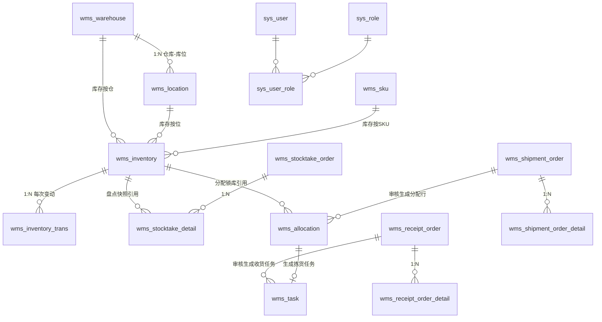

# GoWMS 数据库设计

> MySQL 8.0.16+（依赖 CHECK 约束强制执行）｜ 全表 InnoDB / utf8mb4
> 运行时以 GORM AutoMigrate 为准，本目录 `migrations/001_init.sql` 为人工审阅版，二者结构一致。

## 1. 表清单总览（18 张）

| 分组 | 表 | 说明 |
| --- | --- | --- |
| 系统管理 | `sys_user` | 用户（bcrypt 密码） |
| | `sys_role` | 角色（权限串 `perms`） |
| | `sys_user_role` | 用户-角色关联 |
| | `sys_oper_log` | 操作日志（异步写入） |
| 基础数据 | `wms_warehouse` | 仓库 |
| | `wms_location` | 库位（`{库区}-{排}-{列}`） |
| | `wms_sku` | 货品（编码/条码唯一） |
| **库存** | **`wms_inventory`** | **三数量库存行（核心）** |
| | **`wms_inventory_trans`** | **库存流水（对账依据）** |
| 任务 | `wms_task` | 统一任务（收货/上架/拣货） |
| 入库 | `wms_receipt_order` | 入库单 |
| | `wms_receipt_order_detail` | 入库单明细 |
| | `wms_import_task` | Excel 导入任务（状态机） |
| 出库 | `wms_shipment_order` | 出库单（`biz_order_no` 幂等） |
| | `wms_shipment_order_detail` | 出库单明细 |
| | **`wms_allocation`** | **分配明细（锁库行，FIFO 拆批次）** |
| 盘点 | `wms_stocktake_order` | 盘点单 |
| | `wms_stocktake_detail` | 盘点明细（快照/实盘/差异） |

## 2. ER 关系

> 设计要点：`wms_allocation` / `wms_stocktake_detail` 同时保存 `inventory_id` 与**冗余快照字段**（库位编码、批次、货品编码/名称），保证单据历史不受主数据改名/库存行变化影响——WMS 单据"落纸为凭"的行业惯例。

## 3. 核心表结构

### 3.1 wms_inventory（三数量库存行）

| 字段 | 类型 | 说明 |
| --- | --- | --- |
| id | BIGINT | 雪花 ID |
| warehouse_id / location_id / sku_id / batch_no | — | 库存四维定位 |
| **stock_quantity** | INT | 存量 = 可用 + 分配 |
| **available_quantity** | INT | 可用量（可被分配） |
| **allocated_quantity** | INT | 分配量（已锁定待发货） |
| stock_in_time | DATETIME(3) | 首次上架时间，**FIFO 排序依据** |
| created_at / updated_at / deleted_at | — | 审计字段 |

索引与约束：

- `UNIQUE uk_inv (warehouse_id, location_id, sku_id, batch_no)` —— 库存行的业务身份，防重复建行；
- `CHECK chk_inv_non_negative (available_quantity >= 0 AND stock_quantity >= 0)` —— 防超卖**最后兜底**，配合行锁 + 条件更新构成三层防护。

> 注意：MySQL 8.0.16 起 CHECK 约束才真正生效，低版本仅语法兼容不执行。

### 3.2 wms_inventory_trans（库存流水，只增不改）

| 字段 | 说明 |
| --- | --- |
| inventory_id | 关联库存行 |
| trans_type | `RECEIVE / ALLOCATE / SHIP / RELEASE / ADJUST` |
| quantity_change / before_quantity / after_quantity | 存量三段 |
| available_before / available_after | 可用两段（分配类型时与存量变化方向相反） |
| order_no / task_no / operator | 追溯到单据与操作人 |

索引：`inventory_id`（按行查流水）、`trans_type`、`order_no`（按单对账）、`created_at`（时间范围）。

> 每条流水与业务变更**同事务**写入，因此"库存对不上"在本系统被定义为准 impossibility：任何差异都可回放到具体单据/任务/操作人。

### 3.3 wms_task（统一任务）

| 字段 | 说明 |
| --- | --- |
| task_no | 任务号（收货 `SH` / 上架 `SJ` / 拣货 `PK` 前缀 + 日期 + 序号），唯一 |
| task_type | `RECEIVE / PUTAWAY / PICK` |
| status | `CREATED → IN_PROGRESS → COMPLETED`（单向） |
| order_id / order_no / detail_id / allocation_id | 来源追溯（拣货任务携带分配行） |
| target_qty / done_qty | 目标/完成量，支持分次作业 |
| version | 乐观锁，防重复完成 |

### 3.4 wms_allocation（出库分配明细）

| 字段 | 说明 |
| --- | --- |
| order_id / detail_id | 归属出库单与明细行 |
| inventory_id / location_id / batch_no | 锁定的库存行（FIFO 结果） |
| allocated_qty / picked_qty | 分配量 / 已拣量（可分次拣） |
| status | `ALLOCATED → PICKED`（发货后） |
| version | 乐观锁 |

> 为什么必须有独立分配表：一次审核可能跨多个批次/库位，拣货按行执行、取消需按行释放——没有这张表，"释放哪些库存"就有歧义（本项目踩过的坑，见 requirements 6.2 的反面）。

### 3.5 wms_stocktake_detail（盘点明细）

| 字段 | 说明 |
| --- | --- |
| inventory_id | 被盘库存行 |
| book_qty | 创建时快照账面数（不受后续变动影响） |
| actual_qty | 实盘数（NULL=未盘） |
| diff_qty | 差异 = 实盘 − 审核时账面（审核时锁内重算） |
| adjusted | 是否已产生 ADJUST 流水 |

## 4. 全局设计约定

| 约定 | 说明 |
| --- | --- |
| 主键 | 全部雪花 ID（`BIGINT`），应用层生成，趋势递增 |
| 乐观锁 | 单据/任务/分配/库存行带 `version`，条件更新 |
| 软删除 | `deleted_at DATETIME(3)`，业务唯一索引与软删除的组合语义由代码处理 |
| 时间 | `DATETIME(3)` 毫秒精度 |
| 单号格式 | 入库 `RK`、出库 `CK`、盘点 `PD`、任务 `R/S/P` + 日期 + 序号 |

## 5. 与 AutoMigrate 的关系

- 开发/演示环境：启动时 AutoMigrate 建表 + 种子数据（admin/admin123），**无需手工执行 SQL**；
- 生产环境：DBA 审阅 `migrations/001_init.sql` 建库建表，应用启动时 AutoMigrate 检测无结构差异则跳过。
