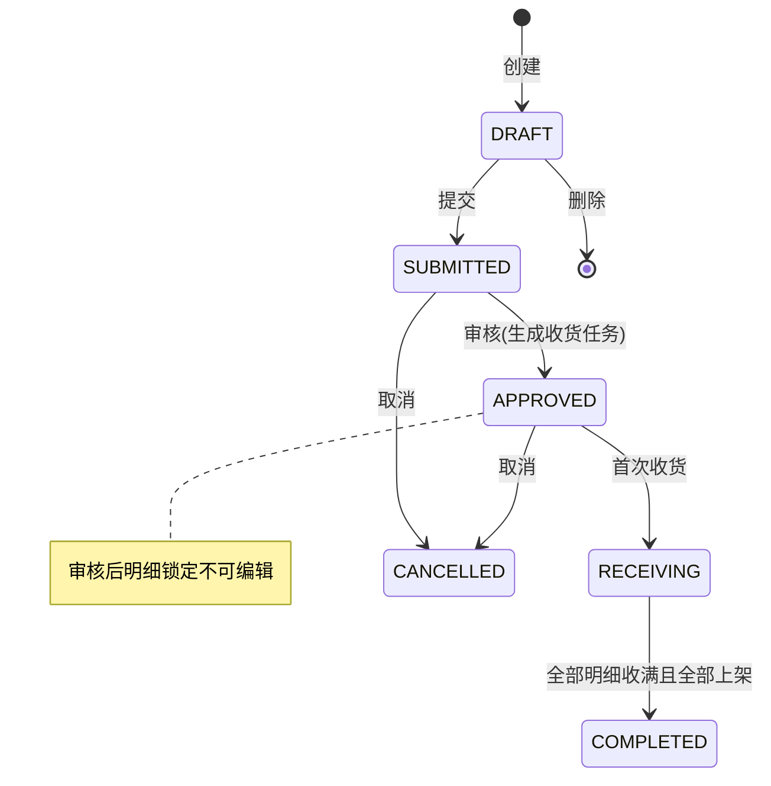
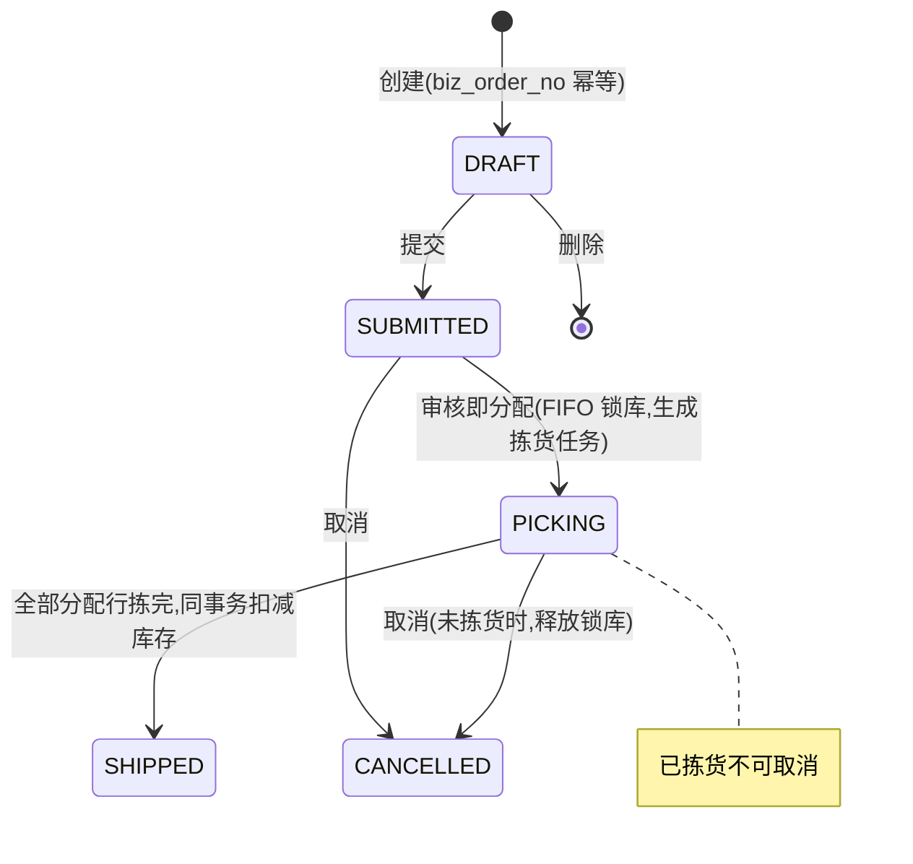
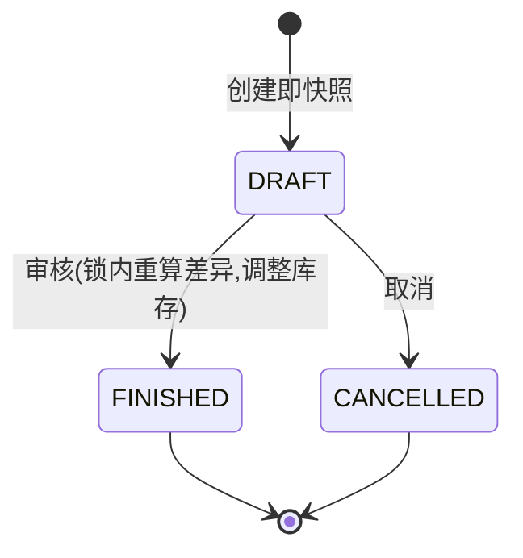
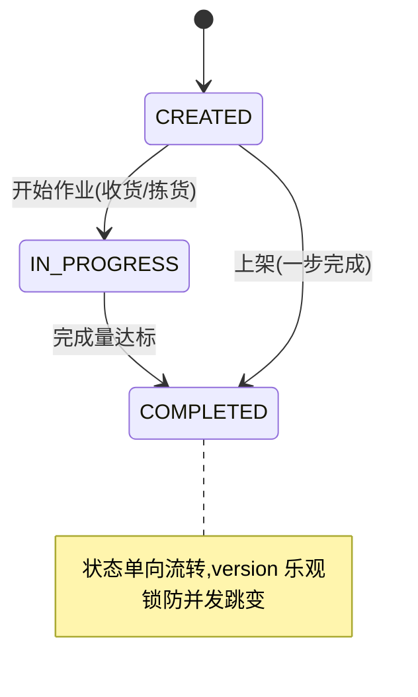

# GoWMS 需求规格说明书

> 版本：v1.0 ｜ 状态：已实现 ｜ 适用范围：GoWMS 轻量级仓储管理系统

## 1. 项目概述

### 1.1 背景

中小仓储场景（电商自建仓、第三方小仓、门店后仓）普遍面临三个问题：

1. **库存账实不符**：缺少流水追溯，出了差异无从查起；
2. **超卖**：并发分配缺乏防护，库存被扣成负数；
3. **流程混乱**：单据状态随意跳转，操作无审计。

GoWMS 是一个**轻量级仓储管理系统**，以"功能简洁、工程亮点完整"为目标，覆盖 **入库 → 库存 → 出库 → 盘点** 的完整业务闭环，可作为中小仓库的生产起点，也可作为学习仓储领域与 Go 工程实践的可运行参考实现。

### 1.2 项目目标

| 目标 | 说明 |
| --- | --- |
| 业务闭环完整 | 入库单全流程、出库单全流程、盘点流程、统一任务中心均可跑通 |
| 库存强一致 | 任何并发操作下库存不超卖、不为负，全部变动有流水可追溯 |
| 流程严格可控 | 单据/任务状态机单向流转，非法跳转被拒绝 |
| 架构可演进 | 模块化单体，模块间仅通过接口通信，预留微服务拆分点 |
| 开箱即用 | 一条命令启动，自动建表 + 种子数据，前端开箱即连 |

### 1.3 术语表

| 术语 | 说明 |
| --- | --- |
| SKU | 最小存货单位（Stock Keeping Unit） |
| 库位（Location） | 仓库内最小存放空间，编码 `{库区}-{排}-{列}`，如 `A01-02-03` |
| 批次号（Batch No） | 同一 SKU 按入库批次的管理维度，FIFO 分配的依据 |
| 三数量 | `stock_quantity`（存量）= `available_quantity`（可用）+ `allocated_quantity`（分配/冻结） |
| 分配（Allocate） | 出库审核时按 FIFO 从可用量划拨到分配量的动作，即"锁库" |
| 收货 / 上架 | 入库的两个作业步骤：先按单收货确认数量，再把货放到具体库位 |
| 拣货 / 发货 | 出库的两个作业步骤：按分配行到库位拣货，全部拣完自动扣减库存 |
| 盘点（Stocktake） | 对指定范围的库存建立快照，录入实盘数并产生调整 |

## 2. 用户角色与权限

### 2.1 角色

| 角色 | 说明 |
| --- | --- |
| 超级管理员 | 内置角色 `admin`（权限串 `*`），拥有全部权限 |
| 业务角色 | 通过权限串组合授权，如 `wms:inbound:receive,wms:inbound:putaway` |

### 2.2 权限模型

- 权限串格式：`wms:{模块}:{动作}`，例如 `wms:outbound:approve`；
- 基础数据类写入统一为 `wms:basic`；
- 后端在路由级通过中间件校验（`middleware.Permission`），前端菜单不按权限裁剪（学习型项目简化，见 6.2 已知边界）。

### 2.3 权限清单

| 权限串 | 控制的操作 |
| --- | --- |
| `wms:system:user` | 用户增删改、启停、重置密码 |
| `wms:system:role` | 角色增删改 |
| `wms:basic` | 仓库/库位/货品的增删改、状态变更 |
| `wms:inbound:create` | 入库单创建/编辑/删除、Excel 导入 |
| `wms:inbound:submit` / `approve` / `cancel` | 入库单提交 / 审核 / 取消 |
| `wms:inbound:receive` / `putaway` | 收货 / 上架 |
| `wms:outbound:create` | 出库单创建/删除 |
| `wms:outbound:submit` / `approve` / `cancel` / `pick` | 出库单提交 / 审核(分配) / 取消 / 拣货 |
| `wms:stocktake:create` / `stocktake` / `approve` / `cancel` | 盘点创建 / 实盘 / 审核 / 取消 |

## 3. 功能需求

### 3.1 系统管理（system）

| 编号 | 需求 | 说明 |
| --- | --- | --- |
| FR-101 | 用户登录 | 用户名 + 密码（bcrypt 校验），签发 JWT；账号禁用后无法登录 |
| FR-102 | 用户管理 | 用户 CRUD、启用/停用、管理员重置密码；用户名唯一（软删除后可重建，唯一索引含 deleted_at 语义由代码保证） |
| FR-103 | 角色管理 | 角色 CRUD，权限串以逗号分隔存储 |
| FR-104 | 个人中心 | 查看个人信息、自助修改密码（需验原密码，改后强制重新登录） |
| FR-105 | 操作日志 | 所有写操作异步记录：用户、路径、方法、参数、IP、耗时、结果；支持按用户名/时间范围筛选 |

### 3.2 基础数据（basic）

| 编号 | 需求 | 说明 |
| --- | --- | --- |
| FR-201 | 仓库管理 | 仓库 CRUD、启停用；编码唯一 |
| FR-202 | 库位管理 | 按"库区前缀 × 排 × 列 × 层"**批量生成**库位（已存在的编码自动跳过，幂等）；支持禁用与删除 |
| FR-203 | 货品管理 | SKU CRUD，编码与条码唯一；条码支持按码即查（Redis 缓存条码→ID 映射，不可用时自动回源数据库） |

### 3.3 库存管理（inventory）

| 编号 | 需求 | 说明 |
| --- | --- | --- |
| FR-301 | 库存明细查询 | 按仓库/库位/SKU/批次查询 `wms_inventory`，展示三数量与入库时间 |
| FR-302 | SKU 汇总查询 | 按仓库聚合同 SKU 各批次的总存量/可用/分配 |
| FR-303 | 库存流水 | 每次变动记录 `RECEIVE/ALLOCATE/SHIP/RELEASE/ADJUST` 流水：变更前后三数量、关联单号/任务号、操作人 |
| FR-304 | 库存增加（内部） | 上架时调用；同维库存行不存在则创建，存在则累加，同事务写流水 |
| FR-305 | 库存分配/释放/扣减/调整（内部） | 供出库/盘点模块通过接口调用，详见架构文档"核心设计" |

### 3.4 入库管理（inbound）

| 编号 | 需求 | 说明 |
| --- | --- | --- |
| FR-401 | 入库单 CRUD | 草稿可编辑/删除；明细含 SKU、期望数量（批次号在收货时登记） |
| FR-402 | 单据流转 | 提交 → 审核（生成收货任务）→ 收货 → （全部上架后）自动完成；可取消 |
| FR-403 | 收货 | 按明细收货，可多次收、允许部分收；登记批次号（FIFO 依据）与良品/不良品数量 |
| FR-404 | 上架 | 为收货任务指定库位上架，库存 Increase + RECEIVE 流水，任务完成 |
| FR-405 | Excel 异步导入 | 上传入库单 Excel 后台解析创建；前端轮询进度（成功/失败行数）；服务重启后未完成任务 2 分钟内自动补偿执行 |

### 3.5 出库管理（outbound）

| 编号 | 需求 | 说明 |
| --- | --- | --- |
| FR-501 | 出库单创建 | 携带 `biz_order_no`（上游业务订单号），唯一索引幂等防重复建单 |
| FR-502 | **审核即分配** | 审核时按 FIFO（批次入库时间）从可用量分配到分配量（锁库），生成分配明细 `wms_allocation` 与拣货任务；库存不足则审核失败 |
| FR-503 | 拣货 | 按分配行到指定库位拣货，可分次拣；单据全部分配行拣完时**同事务自动发货**：扣减存量（stock/available/allocated 同时减）+ SHIP 流水 |
| FR-504 | 取消释放 | 未发生拣货的订单可取消，释放全部锁库（allocated→available）+ RELEASE 流水；已拣货不可取消 |

### 3.6 盘点管理（stocktake）

| 编号 | 需求 | 说明 |
| --- | --- | --- |
| FR-601 | 创建即快照 | 按仓库（可限定库位）对现存库存行拍照 `book_qty`，不受后续变动影响 |
| FR-602 | 录入实盘 | 逐行录入实际数量，自动算差异 |
| FR-603 | 审核调整 | 审核时**在库存行锁内重算差异**（快照与当前账面可能已不同），按最终差异调整库存（stock/available 同步增减）+ ADJUST 流水；差异行标记已调整 |
| FR-604 | 取消 | 审核前可取消 |

### 3.7 任务中心（task）

| 编号 | 需求 | 说明 |
| --- | --- | --- |
| FR-701 | 统一任务 | 收货(RECEIVE)/上架(PUTAWAY)/拣货(PICK) 共用 `wms_task`，含目标量/完成量/操作人 |
| FR-702 | 任务查询 | 按类型/状态/关联单据分页查询，供作业人员领取工作 |

## 4. 业务流程需求（状态机）

### 4.1 入库单

### 4.2 出库单

### 4.3 盘点单

### 4.4 任务

**通用约束**：所有单据状态流转仅允许沿上述图转移（服务层显式校验），并携带 `version` 乐观锁条件更新，防止并发双击导致重复流转。

## 5. 非功能需求

| 编号 | 类别 | 需求 | 实现保障 |
| --- | --- | --- | --- |
| NFR-01 | 一致性 | 并发分配不超卖：库存不足的请求必须失败且不影响他人 | 事务 + `SELECT FOR UPDATE` 行锁 + `WHERE available >= N` 条件更新 + CHECK 约束三重防护（详见架构文档） |
| NFR-02 | 一致性 | 任何库存变动可追溯、可对账 | 全类型流水表，记录变更前后四元数量 |
| NFR-03 | 幂等 | 出库单重复创建、单据重复审核、任务重复完成不产生副作用 | 唯一索引（biz_order_no/order_no/task_no）+ 状态机前置校验 + 乐观锁 version |
| NFR-04 | 可用性 | Redis 故障不阻断业务 | 单号生成降级本地模式、条码缓存回源数据库、健康检查不依赖 Redis |
| NFR-05 | 可靠性 | Excel 导入服务重启不丢任务 | 状态机 + CAS 抢占 + 2 分钟悬挂扫描补偿 |
| NFR-06 | 安全 | 密码不明文、接口需登录、写操作有权限与审计 | bcrypt、JWT 中间件、权限中间件、异步操作日志 |
| NFR-07 | 性能 | 列表分页查询 ≤ 100ms 量级（合理索引下） | 查询条件列 + 外键列 + 状态列索引；流水表按 created_at 索引 |
| NFR-08 | 可维护性 | 模块可独立理解、可拆分 | 模块化单体 + 依赖倒置（模块间仅经 api 接口层）+ 事务边界收敛 Service 层 |
| NFR-09 | 可验证 | 核心承诺有自动化测试证明 | 并发防超卖 / FIFO / 发货释放不变量三个集成测试（无数据库自动 SKIP） |

## 6. 范围外与已知边界

### 6.1 明确不做（保持轻量）

- 多租户、多货主（BO）体系；
- 库位混放策略、上架推荐算法（当前由人工指定库位）；
- 波次拣货、移库、补货预警等进阶作业；
- 消息队列 / 分布式事务（当前单库事务已满足一致性目标）。

### 6.2 简化实现（学习型项目取舍）

- 前端菜单未按权限动态裁剪（后端权限校验完整生效）；
- Excel 导入在应用内异步执行（单实例可靠；多实例部署需外置队列）；
- JWT 未做刷新令牌与黑名单（过期时间可配置）。

---

> 架构与实现细节见 [architecture.md](./architecture.md)，表结构见 [database.md](./database.md)，接口清单见 [api.md](./api.md)。
